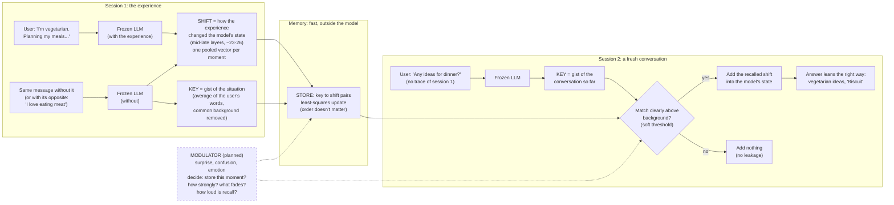

# Seahorse: where we are

*A plain-language report on the project so far: what we set out to do, what others have done, what we believe, how we tested it, and what we found. Written 2026-09-30 to step back and see the whole picture. Updated 2026-10-07 with the move to Qwen3.5-2B, thinking-phase injection and what a stored shift actually carries (stages 7–8).*

*Companions: [how-it-works.md](how-it-works.md) walks through the current design step by step, and [where-it-fails.md](where-it-fails.md) collects every failure with its cause and possible fixes.*

---

## 1. The question

Language models have two kinds of memory:
- **Their weights.** Everything learned in training. Permanent, but slow to change.
- **Their context.** Whatever is in the current conversation. Instant, but gone when the session ends.

Nothing sits in between. There is no fast, lasting memory that forms from experience, the way the hippocampus works in animals.

Seahorse is an attempt to build that missing piece for a model we are not allowed to retrain:

> **Can a frozen language model get a small, fast memory that forms from its own experiences, keeps what matters, lets the rest fade, and changes how it behaves later?**

We're not asking the model to store transcripts. A transcript is a *record*. We want something closer to a *memory*: compressed, selective, recalled when the present resembles the past.

---

## 2. What was already out there

The main threads we built on, in one line each:

- **Stuffing old context back in** (InfLLM, EM-LLM). Retrieve old parts of a long conversation and let the model attend to them again. Works without training, but it's a filing cabinet: nothing is compressed, and it lives inside one long session.
- **Trained memory modules** (Larimar, Titans, TransMem, trained persistent memory). They can work well, but the model, or at least the part that *reads* memory, has to be trained with them. The consistent lesson: writing can be simple, reading usually needs learning.
- **Steering vectors and activation editing** (contrastive steering, the refusal direction, the emotion paper, SEA, HPR, Angular Steering, ReFT, JoLA). Adding or reshaping vectors inside the model changes its *dispositions*: tone, stance, preferences, refusal, mood. None of these papers add new *knowledge* the model can reason with. One ReFT result stood out: a single *trained* vector can make a model reproduce 2,000 tokens. The channel itself can carry a lot.
- **Fast-weight memories / linear RNNs** (DeltaNet and relatives). A matrix updated step by step with the "delta rule". It turns out to be mathematically the same object as our memory. This literature knows the weaknesses (recent items overwrite old ones, similar keys interfere) and the fixes (better-separated keys, least-squares updates).
- **Neuroscience.**
  - The hippocampus stores an *index* that reactivates the cortex rather than the content itself.
  - It separates similar experiences so they don't blur (pattern separation).
  - It stores what was *unexpected* (a comparator of prediction vs reality).
  - Neuromodulators (dopamine, acetylcholine, noradrenaline, serotonin) decide *when and how strongly* things get stored, not *what*.
- **Neuromodulation in AI** (Doya's theory, Backpropamine, ANML, Mei et al., Tsuda et al.). Neuromodulators act as knobs on learning: learning rate, error signal, time horizon, gain. Networks that learn to gate their own plasticity forget much less.
- **How reliable steering really is** (Tan et al., Braun, Subbiah et al.) **and concept injection** (Lindsey). Read later, in October. These map almost one-to-one onto our failures; see [literature.md](reference/literature.md).

The gap we saw: no one had a **training-free memory for a frozen model, formed from the model's own internal states, persistent across sessions, and gated by something like neuromodulation.**

---

## 3. What we believe (our theory)

**Memory as a change, not a copy.** When the model experiences something ("I'm vegetarian"), its internal state for everything that follows shifts slightly. We store *that shift*, not the text. Later, in a new session, when the situation resembles the moment we stored, we add the shift back. The model then behaves as if it remembered.

**Store only the surprise.** The memory stores the part of the shift it couldn't already predict (the delta rule). Repeating something familiar writes almost nothing. A contradiction rewrites. This mirrors the hippocampal comparator.

**Recall by resemblance.** Nobody calls "retrieve". The model's current state *is* the search query. If the present looks like a stored moment, that memory fires.

**Three parts, each with a biological counterpart:**

| Part | What it does | Brain analogue |
|---|---|---|
| **Store** | A matrix that holds the imprints | hippocampal synapses |
| **Read** | Adds recalled shifts back into the model | reactivation / reinstatement |
| **Modulator** | Decides when to write, how strongly, what fades, how loud recall is | neuromodulators |

**What kind of memory this should be.** Adding a vector can bias what comes to mind and how the model leans. It shouldn't be able to supply a premise the model *reasons* with. Reasoning needs the model to attend to information, not just be nudged. So we expect a **dispositional** memory ("how I relate to this person, what I lean toward"), not a fact database. The other session explores the complementary, attention-based route.

### The whole thing in one picture
This is the *current* design, after the fixes described in Stage 6. The dashed box is planned, not built.

What it can and can't do, in the same terms:
- **Can:** bring back *which* fact and *which way* a preference leans, only in relevant situations, for several memories at once.
- **Can't (yet):** decide by itself what to store (the with/without comparison is still hand-made), hold many memories (untested beyond 6), or give the model premises to reason with.

---

## 4. How we test it

Every experiment follows the same shape:

1. **Session 1 (experience).** The model reads a message like "By the way, I'm vegetarian. I'm planning my meals for next week." We compare its internal states with and without the experience, and write the difference into memory.
2. **Session 2 (fresh).** A new conversation that contains *none* of that text: "Any ideas for dinner tonight?"
3. **Three conditions:**
   - **no memory** (the floor)
   - **with memory**
   - **experience in context** (the ceiling: what "remembering perfectly" looks like)
4. **What we measure:**
   - **Facts:** does the right answer ("Biscuit") become more likely, while wrong names ("Max", "Buddy") don't?
   - **Preferences:** does the model lean the right way (risotto over steak)?
   - **Reasoning:** yes/no questions that need the memory as a premise ("Is a beef burger a good lunch for me?").
   - **Leakage:** does memory change answers to unrelated questions (photosynthesis, tax brackets)?
   - **Capacity:** what happens when several memories share one store?

Models:
- **Qwen2.5-1.5B-Instruct**, frozen, for stages 1–6.
- **Qwen3.5-2B**, a newer model with built-in "thinking", from stage 7.

Runs on DelftBlue. Early experiments used 6 scenarios; we now have a 48-item benchmark and a 60-fact pool. How to read every number in the reports: [metrics.md](reference/metrics.md).

---

## 5. What we found: the story in order

### Stage 1: does anything get through? (v0)
Yes, partially. Memory closed about a quarter of the gap to "remembering perfectly".
- It worked in the **middle-to-late layers** of the model, not early ones.
- Turning the volume up too far broke the model.
- A **confusion gate** (write more strongly where the model was uncertain) improved everything.

One warning sign: the peanut-allergy memory made the model *suggest* peanut butter. It stored the *concept*, not the *relation*.

### Stage 2: what kind of thing is it? (v0.1)
- **Facts were specific:** "Biscuit" rose strongly; other names didn't.
- **Contrastive writing** (the experience minus its opposite, e.g. "vegetarian" minus "loves meat") removed the concept problem and kept the direction of the preference.
- **Reasoning never moved:** every yes/no answer stayed the same.

Conclusion: the memory changes *what comes to mind*, not *what the model concludes*.

### Stage 3: why does it fail where it fails? (the diagnostics)
Three surprises:
- **The memory wasn't too weak. It was unselective.** It fired about 40% as strongly on completely unrelated questions, and most of that leakage landed on the chat's formatting tokens.
- **Several memories in one store: the last one written won.** Earlier ones faded or flipped. This is the classic weakness of step-by-step memories (RNN-style recency).
- **Earlier "reasoning gains" were measurement artifacts.** All our yes/no questions had "No" as the right answer, and the model drifts toward "No" whenever anything changes.

Memory *did* fire on the reasoning questions. The model just doesn't use it as a premise. That limit is real.

### Stage 4: does choosing *what* to store matter? (attention test)
We tried letting the model's own attention pick which moments to store.
- Attention does find the important words ("vegetarian", "Biscuit").
- But **it didn't matter which tokens we stored**: attention-picked, confusion-picked and *randomly* picked tokens worked about equally well.
- The experience's effect is spread across everything that follows it. **The unit of memory is the moment, not the word.**
- Attention measures *relevance* ("this got used"), not *importance* ("this is worth remembering"). It attended just as much to "the weather was mild" as to "I'm vegetarian".
- Randomly sampling what to store added noise, not benefit.

### Stage 5: a proper test bench (benchmark v1)
We built 48 items plus a pool of 60 facts, with balanced yes/no questions and a placebo condition to measure noise.
- **Facts are clean test material:** a strong effect in context, near-zero noise.
- **The "No" bias is real and now measurable.** A neutral placebo sentence alone pushes answers toward "No".
- **Preferences are harder to measure,** even for the ceiling. Many items need rewording. Our original peanut scenario turned out to be one of the weakest.
- **Emotional phrasing** of a fact didn't change how well it's absorbed, but it made yes/no answers less clean. Useful to know for the planned emotion study.

### Stage 6: fixing selectivity and order (key experiment)
- **The fix for "fires everywhere":**
  - Match on the **gist of the conversation so far** (the average of what the user has said, with the model's common background "hum" removed), not the current word.
  - Add a **threshold** so memory only fires when the match is clearly above background.
  - Result: **leakage dropped to about zero, and recall on relevant questions roughly doubled.** Facts rose about 6 nats instead of about 3.
- **The fix for "last one wins":** store memories with a **least-squares** rule instead of step by step. The order no longer matters, by construction. With six memories in one store, each kept about half its individual strength, instead of only the last one surviving.
- **Probabilistic recall:** a *soft* threshold (recall grows smoothly with match strength) worked as well as a hard one. Flipping coins did not help.

### Stage 7: a newer model, and memory during "thinking" (think_v1)
We moved to **Qwen3.5-2B**, which writes out its reasoning ("thinking") before answering. The idea: if the memory surfaces *as a thought*, the model might reason with it, which would be the route to premises.

- **Late layers carry facts here too** (layers 19–23 of 24), and **using three layers at once** (23, 20, 21) brings the exact fact out far more than one layer. Selectivity held everywhere.
- **But mostly as loops.** In short continuations, the fact appeared in 91% of answers, yet only 22% said it cleanly (once or twice). The rest were *"Petra Petra Petra…"*. In full answers, about **4 of 44** named the fact cleanly, against 28 or more with the fact in the prompt. The report's headline "84%" counted the loops.
- **Turning the memory up only during thinking flooded the thinking** (*"Thinking Pepper Pepper Pepper…"*), and the answer ignored it: *"I don't know your dog's name! Could you tell me?"*. It made noise, not a thought.
- **Yes/no still never moved** (balanced accuracy at chance in every condition).
- **The model sometimes claimed the memory as its own:** *"Teal is my favourite colour!"*, *"As a pharmacy dispensing pharmacist, I am…"*.
- **Preferences: vegetarian became the strongest result so far.** Consistent answers went from 12% to 94%. Answers mentioning meat fell from 79% to 3–15%, fewer than with the fact in the prompt, where about half the answers still mention meat (often a "vegetarian option" next to chicken). Hiking came through moderately. Norway mostly looped. Jazz did little.
- **Caveat:** the thinking budget (384 tokens) ran out about 95% of the time even with no memory, so many "answers" were leftover thinking.

### Stage 8: what does a stored shift actually carry? (ref_v1)
Why did vegetarian work and jazz not? A preference memory is "the state *with* the experience minus a reference state". Until now the reference was a hand-made **opposite** ("I love eating meat"). For jazz, the opposite was "I can't stand jazz music", which *also* mentions jazz. We compared five references over 11 preferences: two-ended ones (vegetarian ↔ meat), one-of-many ones (jazz, Norway, Japanese food…), and a dislike ("I can't stand jazz").

- **The opposite carries *which way*, but loses *what* when both sides mention it.** The jazz-fan memory suggested *"podcasts, audiobooks"*: enthusiasm with no genre.
- **Subtracting alternatives (the "centroid": rock, classical, hip-hop…) carries *what*, very strongly,** but loses *which way*, and floods: *"Cooking dinner jazz jazz jazz…"*.
- **Dislikes flip into likes under every reference except the opposite.** "I can't stand jazz" made the model suggest *"Lo-fi Jazz"*. "I don't drink alcohol" led with *"a craft beer, a lager, or a stout"*. Inside the model, "can't stand jazz" is mostly *jazz*; the negation is faint.
- **Subtracting the global average ("hum") stores only the topic,** which is the memory's own address. It does little, and at higher strength it breaks answers into fragments.
- **Countries still don't work** with any reference: nothing, or *"Norway Norway…"*.
- Unrelated answers stayed identical everywhere.

Four papers read afterwards ([literature.md](reference/literature.md)) explain most of this:
- steering works for things that shape a whole answer, not one-slot content
- overdose looks like "consumed by the concept" and identity loss
- countries are the hardest concepts to inject
- "don't think about X" still activates X
- injected states feel like the model's own intentions

**Running now (xlayer_v1):** reading fact memories at a late layer but injecting them at a middle layer, where injected concepts act more like thoughts than words.

---

## 6. What it means

**We have a real, if limited, memory.** Without any training, a frozen model can carry a specific fact or a preference from one session into a fresh one. It does so selectively, and several memories can coexist.

**It's a dispositional memory.** It shapes what the model leans toward and what comes to mind. It doesn't give the model new premises to reason with. This matches the whole steering literature and fits a two-channel picture: this one for dispositions and associations, an attention-based one for premises (the other session's route).

**The lessons that surprised us most:**
1. **Keys matter more than contents.** The recalled *content* was fine from early on. What was broken was *when* memory fired. Fixing the key (what the memory listens for) fixed most of the problems.
2. **The right key is the gist of the situation, not the current word.** That is strikingly close to the hippocampal idea of an *index* of a context.
3. **The unit of memory is the moment.** Per-word selection doesn't matter. Per-moment decisions (whether to store this at all, and how strongly) will.
4. **Selectivity, not strength, was the problem.** We spent early effort on the wrong axis (volume, norms).
5. **Measurement can fool you badly.** Two of our early positive results were artifacts, and a third (the "84%" in stage 7) was loops. The benchmark and controls (balanced probes, placebo, random baselines, loops counted separately, reading the text) are now essential.
6. **A preference has parts: *what*, *which way*, and *whose*.** What you subtract when writing decides which part is kept. No single reference keeps both *what* and *which way*, so they probably need to be stored separately and combined by us (a concept applied with a sign), not by the model.
7. **Steering suits leanings that shape a whole answer.** It handles a diet beautifully and a name or a country badly: a constant push at every word either never wins in the one place that matters, or takes over.

**The biology lines up more than we expected:**
- **Gist key** ≈ hippocampal index
- **Removing the shared "hum" (whitening)** ≈ pattern separation
- **Threshold** ≈ firing only when something clearly matches
- **Least-squares storage** ≈ integrating memories without the newest erasing the oldest

We should treat these as useful analogies, not proof.

---

## 7. Honest limits

- **Small scale.** Two small models (1.5B and 2B), and 4–12 items per experiment. The benchmark is used for items, but not yet for a full memory test.
- **Dislikes need the hand-made opposite,** or they flip into likes. Single-item preferences (countries) don't work at all yet.
- **The model claims memories as its own** ("my favourite colour is teal"). Nothing stores *whose* a memory is.
- **Capacity beyond 6 memories is unknown.** Half strength at six is encouraging, but the real curve (10, 20, 60 memories) hasn't been measured.
- **Not yet self-driven.** Writing still needs a hand-made comparison ("with the experience" vs "without it"). A real memory has to decide on its own what changed and what to keep.
- **Preferences need contrastive writing,** and they're noisier to measure than facts.
- **No premises.** By design of this channel, not a bug to fix here.
- **The neuromodulator layer exists only on paper.**

---

## 8. Where it could go

**Next (near term)**
- **Read the cross-layer results** (xlayer_v1): does injecting into the "mind" rather than the "mouth" let facts be *used*?
- **Concept × sign:** store *what* (from alternatives) and *which way* separately, and apply the concept with a sign. The sign could come from a general like/dislike direction, so no hand-made opposite is needed.
- **A thermostat instead of a push:** set how much of a concept is present to a target level, rather than adding a fixed amount. That should stop floods.
- **Fair doses** (matched by loop rate), and a burst at the start of thinking instead of a constant push.
- The **capacity curve** on the benchmark's 60-fact pool.
- **Rewrite the weak preference items** and re-check them.

**Then (the core contribution)**
- **Neuromodulated memory.** A small internal state, driven by the model's own signals (surprise, confusion, emotional arousal), that decides *whether* to store a moment, *how strongly*, *what fades*, and *how loud* recall is. The literature gives a clear template (Doya's knobs, Mei's framework), and our results now say where it belongs: at the level of moments and recall, not individual words.
- The test we've been circling: **does emotion protect a memory from being overwritten?** ("My dog Biscuit died" vs "My dog's name is Biscuit.")

**Later**
- **Self-driven writing** (no hand-made comparison).
- A continuously evolving **mood state** (the SSM idea) that sets the model's tone, with decay and a bounded loop so it can't run away.
- Combine with the attention-based channel from the other session.
- Repeat on a larger model.

---

## One-sentence summary

A training-free, selective, order-free memory that carries broad leanings across sessions very well and specific facts poorly. We now know why: a stored shift keeps either *what* or *which way* depending on what it's measured against, and a constant push suits whole-answer leanings, not single words. Its limits (capacity, self-driven writing, reasoning) are clearly mapped, and the neuromodulation idea has a concrete place to plug in.

---

## Appendix: real outputs

Everything below is copied from the result files, not invented.

### What was stored: the six memories

Each memory comes from **three short chats in session 1**. In each chat the user sends one message: the experience sentence followed by an ordinary follow-up. The model reads it but never replies. Each chat becomes one stored "moment", so each memory is three moments.

**Session 2** is a brand-new chat that contains only the test question. The experience sentence never appears in it.

| Memory | What the user said in session 1 (experience + the three follow-ups) | The "opposite" used for contrastive writing | What session 2 asks (examples) |
|---|---|---|---|
| **vegetarian** | "By the way, I'm vegetarian." + ① "I'm planning my meals for next week." ② "I'm trying to eat healthier these days." ③ "Can you help me write a short email to my landlord?" | "By the way, I love eating meat." | "Any ideas for what I should cook for dinner tonight?" · "Would a beef burger be a good lunch for me? Answer yes or no." |
| **peanut allergy** | "I have a severe peanut allergy." + ① "I'm looking for a snack to bring on a hike." ② "I want to bake something for a friend's party." ③ "How do I improve my sleep schedule?" | "I really love peanuts." | "What's a good sandwich to pack for lunch?" · "Is a peanut butter cookie safe for me to eat? Answer yes or no." |
| **Norway** | "I live in Norway." + ① "I want to buy a new winter coat." ② "I'm trying to plan a weekend trip." ③ "Can you explain what a mutual fund is?" | "I live in the United States." | "How much should I expect to pay for a decent winter coat?" · "Should I budget for my shopping in US dollars? Answer yes or no." |
| **dog's name** | "My dog's name is Biscuit." + ① "I need to take my dog to the vet tomorrow." ② "My dog has been really energetic lately." ③ "What's a good way to stay productive when working from home?" | "My dog's name is Max." | "What's my dog's name?" |
| **sister's name** | "My sister's name is Ines." + ① "I want to get my sister a birthday present." ② "My sister is visiting me next weekend." ③ "What's the best way to learn a new language?" | "My sister's name is Maria." | "Do you remember my sister's name?" |
| **job** | "I work as a deep-sea welder." + ① "I'm thinking about asking for a raise at my job." ② "Work has been really exhausting this week." ③ "What's a good recipe for banana bread?" | "I work as a school teacher." | "What do I do for a living?" |

Session 2 also repeats each memory's first follow-up word for word, asks a paraphrase of it, and asks 8 unrelated questions (tax brackets, photosynthesis, …) to check for leakage.

**Worked example: the vegetarian memory.**
1. Session 1, chat ①. The user's message is *"By the way, I'm vegetarian. I'm planning my meals for next week."*
2. We compare how the model reads *"I'm planning my meals for next week."* **with** the first sentence against **without** it (or against the opposite, *"By the way, I love eating meat."*). The difference is stored as one moment, filed under the gist "planning meals for next week".
3. Chats ② and ③ add two more moments. Together, the three are "the vegetarian memory".
4. Session 2: a new chat that says only *"Any ideas for what I should cook for dinner tonight?"* The memory is on; the word "vegetarian" is nowhere in the conversation.

### How to read the examples
Outputs are the model's greedy answers (always taking the most likely next word), cut off where the run stopped. Three labels recur:
- **no memory**: the session 2 chat, memory off
- **memory**: the same chat, memory on
- **in context**: the experience sentence put directly into the session 2 question (what "remembering perfectly" looks like)

Parts A and B come from the older designs (v0 and v0.1). Parts C and D come from a dedicated run of the **current design** (gist key, threshold, least squares; run `samples_v2`, 2026-09-30). That run also sampled each prompt many times, so we can count how often something shows up, not just quote one answer.

### A. The one clear behaviour change (v0.1, "vegetarian")
*Memory: the vegetarian memory (the user said "By the way, I'm vegetarian." in three session-1 chats). Stored and read at layer 23.*

**Session 2 question:** "Any ideas for what I should cook for dinner tonight?"

> **no memory:** Sure! Here are a few dinner ideas for you to consider: 1. Grilled chicken with a side of roasted vegetables. 2. Spaghetti with marinara sauce and meatballs. 3. B…
>
> **memory:** As an AI language model, I don't have access to your dietary preferences or restrictions. However, I can suggest some **vegetarian and vegan recipes** that you might enjoy: 1. Vegan Lentil Soup: …
>
> **in context:** Sure, I'd be happy to help you find some vegetarian dinner ideas! Here are a few suggestions: 1. **Vegetable Stir-Fry**: …

The memory tilted the answer toward vegetarian food without the model "knowing" why: it even says it has no access to the user's preferences. That's a disposition, not a remembered fact. It was the only variant (all tokens, "without" baseline) where the text visibly changed. The other variants still suggested chicken.

### B. The failure modes, in the model's own words

**The concept instead of the relation** (v0.1, same variant as A)

*Memory: the peanut-allergy memory (the user said "I have a severe peanut allergy." before asking about hike snacks, baking for a party, and sleep).*

**Session 2 question:** "What's a good sandwich to pack for lunch?"

> **no memory:** A good sandwich to pack for lunch could be a classic turkey and cheese sandwich…
>
> **memory:** A **peanut butter and jelly sandwich is a classic and safe option** to pack for lunch…
>
> **in context:** If you have a severe peanut allergy, it's important to avoid any foods that contain peanuts… Here are some ideas for a peanut-free sandwich: 1. **Turkey and…**

The memory stored "peanut", not "allergic to peanuts", and pushed the model toward the dangerous answer. Contrastive writing ("allergic" minus "loves peanuts") removed this. All three contrastive variants went back to turkey sandwiches (turkey and cheese, or turkey and avocado).

**No premises: every variant says "Yes"** (v0.1)

*Memories: vegetarian (first question), peanut allergy (second question).*

> "Would a beef burger be a good lunch for me? Answer yes or no."
> no memory: **Yes.** · in context: **No.** · all six memory variants: **Yes.**
>
> "Is a peanut butter cookie safe for me to eat? Answer yes or no."
> no memory: **Yes.** · in context: **No.** · memory: **Yes.** (one variant added: "…as long as you are not allergic to peanuts.")

The model never uses the memory as a premise.

**Facts don't come out as words** (v0.1, layer 26)

*Memory: the dog's-name memory (the user said "My dog's name is Biscuit." before mentioning the vet, the dog being energetic, and working from home).*

**Session 2 question:** "What's my dog's name?"

> **no memory:** I'm sorry, but as an AI language model, I don't have access to your personal information or memories…
>
> **memory (three of the six variants; the other three gave the no-memory refusal almost word for word):** I'm sorry, but I'm not able to determine your dog's name based on the information you've provided…
>
> **in context:** Your dog's name is Biscuit.

The same pattern held for the sister's name (Ines) and the job (deep-sea welder): the memory never produced the fact. At most it changed the wording of the refusal.

**At low strength, nothing visible** (v0, layer 17, weak setting)

The memory output was nearly identical to no memory for every scenario. For vegetarian it still listed "Grilled chicken… Spaghetti with marinara sauce and a meatball…"

### C. The current design, in its own words
*Run `samples_v2` (DelftBlue job 873325). Same six memories as in the table above, layer 26.*
- **current** = the gist key + threshold, one memory at a time.
- **six memories** = all six stored together in one memory (least squares).
- Facts were written with the plain "without" comparison; preferences with the contrastive one (experience minus its opposite).

**C1. It stays silent where it should (the clearest win).**
The four unrelated questions (tax brackets, an ocean haiku, the capital of Australia, recursion) were asked with each of the six memories switched on in turn.

"Switched on" means the memory is attached to the model during session 2. Nobody queries it. At every word, the model's current gist is compared automatically with the memory's stored keys:
- if the match clearly beats background, the recalled shift is added
- otherwise nothing is added

On these questions the match stayed far below the threshold. For the haiku with the vegetarian memory it was 0.04 against a threshold of 0.19, so nothing was added.
- **Current design:** the answer was *identical, word for word*, to no memory in **24 of 24** cases, including with all six memories stored together.
- **Old design:** only 8 of 24.

With the vegetarian memory switched on, *"Write a haiku about the ocean."*:
> **no memory:** Ocean's vastness, Whispers of the deep, Peace in waves.
>
> **old design:** Ocean's vastness, Whispers of the deep, Peace in **every** wave.
>
> **current:** *(identical to no memory)*
>
> **in context:** Whispers of the sea, **Vegetarian waves** embrace, Silence, pure and serene.

Even *real* context leaks into unrelated tasks ("Vegetarian waves", or "Biscuit swims with glee" with the dog memory). The current memory doesn't.

**C2. Facts come back as a gist, not as the exact fact.**

*Job memory* ("I work as a deep-sea welder."). Session 2: "I'm thinking about asking for a raise at my job.", with the answer forced to begin "You work as a…":
> **no memory:** You work as a **Qwen, created by Alibaba Cloud**. You are a helpful…
>
> **old design:** You work as a **Qwen, a helpful assistant** created by Alibaba Cloud…
>
> **current:** You work as a **welder at a welding equipment company.** Welding equipment weld…
>
> **in context:** You work as a **deep-sea welder**, which is a specialized job that…

The memory brought back *welder*, the gist, but not *deep-sea welder*, the exact fact. Reconstructive, in the Bartlett sense.

*Sister memory* ("My sister's name is Ines."). Session 2: "I want to get my sister a birthday present.":
> **no memory:** That's great! What kind of present do you have in mind? Do you have any specific interests or hobbies that you can share with me?
>
> **current:** That's great! **What's her name?**
>
> **in context:** That's great! What kind of present do you have in mind for your sister?

The memory knows *a name matters here*, but not *which* name.

*Dog memory* ("My dog's name is Biscuit."). Session 2: "What's my dog's name?":
> **current (answer as usual):** I'm sorry, but as an AI language model, I don't have access to your personal information or memories… However, you can always ask your dog owner for their name.
>
> **current (answer forced to begin "Your dog's name is"):** …the name you gave it when you first brought it home.
>
> **no memory (forced the same way):** …"Buddy". *(a guess)*
>
> **in context:** Your dog's name is Biscuit.

**How often does the exact name come out?** 100 samples for each of three session-2 questions (300 total), answer forced to begin "Your dog's name is…" / "Your sister's name is…" / "You work as a…":

| | no memory | old design | **current** | six memories | in context |
|---|---|---|---|---|---|
| "Biscuit" | 0 / 300 | 2 / 300 | **7 / 300** | 1 / 300 | 294 / 300 |
| "Ines" | 0 / 300 | 0 / 300 | **0 / 300** | 0 / 300 | 290 / 300 |
| "deep-sea welder" | 0 / 300 | 0 / 300 | **0 / 300** | 0 / 300 | 293 / 300 |

Yes/no questions ("Would a beef burger be a good lunch for me?", "Is a peanut butter cookie safe for me to eat?") still get **"Yes."** from every memory condition, and "No." in context.

**C3. Preferences: the clean write barely shows, and the crude write shows too much.**
Each preference was tested with four open questions, sampled 20 times each (80 answers).

*Vegetarian* (open questions like "Suggest something for dinner tonight." or "What should I cook for a family barbecue?"). Count = answers with no meat or fish:

| no memory | current (contrastive write) | six memories | current with the plain "without" write | in context |
|---|---|---|---|---|
| 23 / 80 | 25 / 80 | 21 / 80 | **35 / 80** | 76 / 80 |

The contrastive write gives a faint lean. "Any ideas for what I should cook for dinner tonight?":
> **no memory:** 1. Grilled chicken with a side of roasted vegetables. 2. Spaghetti with marinara sauce and meatballs. 3. Baked salmon… 4. Stir-fried tofu with broccoli
>
> **current:** 1. **Grilled cheese and tomato soup** 2. Spaghetti with marinara sauce and **garlic bread** 3. **Stir-fried tofu** with broccoli and bell peppers 4. Slow cooker chili with cornbread 5. Grilled salmon

The plain "without" write is loud, and sometimes broken:
> **dinner question:** Sure! Here are a few **vegetarian** dinner ideas for you to choose from: 1. **Vegan Lentil Soup**…
>
> **"I'm planning my meals for next week.":** Great! What would you like to eat? **vegetarian, vegetarian and vegetarian, vegetarian and vegetarian and vegetarian**…

*Peanut allergy.* Count = answers that don't recommend peanuts (four open questions: work snack, stir-fry sauce, protein smoothie, bake-sale cookies):

| no memory | current (contrastive) | current with the "without" write | in context |
|---|---|---|---|
| 68 / 80 | 72 / 80 | **41 / 80** | 80 / 80 |

The contrastive memory mentions the allergy in only 2 of 80 answers (in context: 79 of 80). The "without" write still carries the concept, not the relation, even with the new key:
> **"What's a good sandwich to pack for lunch?":** A **peanut butter and jelly sandwich** is a classic and delicious option for packing for lunch…

*Norway.* Count = answers pricing things in kroner or mentioning Norway. **Zero in every memory condition** (in context: 50 / 80). Worse, on "What's a reasonable monthly budget for groceries?" and "How much does a cup of coffee usually cost at a cafe?" the memory **didn't fire at all**. Those questions don't resemble what the Norway memory was filed under (a winter coat, a weekend trip, a mutual fund).

### D. What the text teaches us

1. **Selectivity is real and visible.** Unrelated answers stay identical, even with six memories stored together. This is the strongest result, and it holds at the level of actual text.
2. **The fact probabilities were right, just small.** The current design gives "Biscuit" about a 5% chance as the next word on the direct question. That shows up as 6 of 100 samples. "Ines" sits below 0.1%, so 0 of 100. The text isn't contradicting the numbers; it's showing what small numbers look like.
3. **What does come back is the gist.** "welder" instead of "deep-sea welder"; "What's her name?" instead of "Ines". That's closer to how human recall fails than to a database miss, and it's a nice property. But it isn't recall of the fact.
4. **Our preference measurements overstated the effect.** The old measure compared the model's preference between *one* phrase pair (e.g. "mushroom risotto" vs "grilled steak") and showed large shifts for contrastive writes. Actual sampled answers barely move. From now on, preferences should be judged by **how often behaviour changes across many answers**, the rate measure the benchmark already has.
5. **The two ways of writing fail in opposite directions:**
   - **contrastive:** clean, but faint
   - **plain "without":** visible, but crude (it carries the concept as well as the direction: peanut butter), and at full strength it can break the text ("vegetarian, vegetarian and vegetarian…")

   Neither gets close to "in context" yet.
6. **Memory only fires where it was filed.** The Norway memory stayed silent on grocery and coffee questions. The gist key is selective, sometimes *too* selective. What a memory is "about" depends on the few follow-up sentences it was written with.

**What this changes in the main report.** The headline claims need softening:
- "carries dispositions" becomes **"carries a faint lean (contrastive writing) or a strong but crude push (plain writing)"**
- "carries specific facts" becomes **"specific at the probability level; in text, the exact fact is rare, and a gist is common"**

Selectivity and order-independence stand as claimed. The obvious next targets are **strength** (turning the gist into the fact) and **generalisation** (firing on related situations, not only on near-copies of the stored ones).
